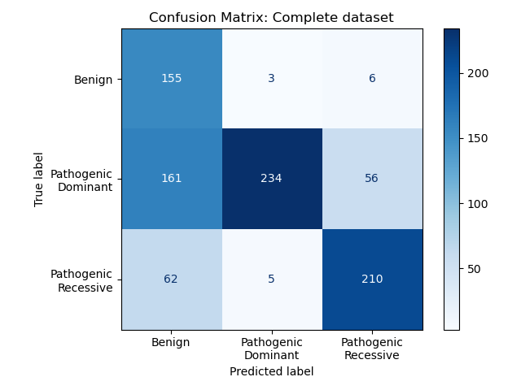

## Replication of the MAVERICK training

MAVERICK is an ensemble model that predicts pathogenicity of genomic variants in the patient's genome and suggests candidate variants for the cause of Medelian diseases. 
The aim of this work was to train this model again specifially for autoinflammatory diseases. Since the experiment was focused mostly on the variants used for the training, the data assembly and the training procedure were followed as close to the original work as possible. This project was done as part of the thesis practical phase at the Hochschule Bonn-Rhein-Sieg.

The source code and the data were taken from the original MAVERICK article:

> Danzi, M.C., Dohrn, M.F., Fazal, S. et al. 
> Deep structured learning for variant prioritization in Mendelian diseases. 
> Nat Commun 14, 4167 (2023). [https://doi.org/10.1038/s41467023393067](https://doi.org/10.1038/s41467023393067)

The files are available on the original Github page: https://github.com/ZuchnerLab/Maverick

### Data assembly

To train the model again, a new set of variants was assembled. This was done in two steps:
1. Collecting the ClinVar and gnomAD variants (hg38) at the moment of January 2025.
2. Filtering only pathogenic variants in the genes related to autoinflammation.

The first part was done similarly to the the original procedure in `CreateTrainTestSets.ipynb`.
The list of files used for the variant annotation is shown in the table below. 

|Data|Original assembly|Updated assembly|
|-|-|-|
|ClinVar variants|variant_summary_2020-01.txt|variant_summary_2025-01.txt|
|gnomAD benign variants|gnomADVariantsSeenAsHomAlt- TwiceInExomes.txt|gnomad.exomes.v4.1.sites.benign.txt|
|Inheritance map|genemap2_20200114.txt|genemap2_20240702.txt|
|ANNOVAR database|wgEncodeGencodeBasicV33lift37|wgEncodeGencodeBasicV47|
|Approved transcripts|gencodeBasicFullLengthTranscripts- ConversionTable.txt|gencodeBasicFullLengthTranscripts- ConversionTable_v47.txt|
|Canonical transcripts|gnomad211_constraint_simple_canonical.txt|gnomad.v4.1.constraint_simple_canonical.tsv|
|Gencode transcripts|gencode.v33lift37.pc_translations.fa|gencode.v47.pc_translations.fa|
|GTEx|GTEx.V7.tx_medians.021820.tsv|GTEx.v10.medians.tsv|
|pLI|gnomad211_constraint_simple_canonical.txt|gnomad.v4.1.constraint_simple_canonical.tsv|
|pRec|gnomad211_constraint_simple_canonical.txt|gnomad.v4.1.constraint_simple_canonical.tsv|
|pNull|gnomad211_constraint_simple_canonical.txt|gnomad.v4.1.constraint_simple_canonical.tsv|
|mis_z|gnomad211_constraint_simple_canonical.txt|gnomad.v4.1.constraint_simple_canonical.tsv|
|lof_z|gnomad211_constraint_simple_canonical.txt|gnomad.v4.1.constraint_simple_canonical.tsv|
|controls AF|gnomad211_exomes_AFs.txt|gnomad410_GRCh38_exomes_AFs.txt|
|controls nhomalt|gnomad211_exomes_AFs.txt|gnomad410_GRCh38_exomes_AFs.txt|
|CCR|ccrs.enumerated.txt|ccrs_GRCh38.enumerated.txt|
|PEXT|gnomAD_pext_values.txt|gnomAD_pext_values.gtex.v10.txt|
|GERP|gerpOnExons.txt|gerpOnExons_GRCh38.txt|
|GDI|GDI.groomed.txt|GDI.groomed.txt|
|RVIS|RVIS.groomed.txt|RVIS.groomed.txt|

The variants from the gnomAD that were observed at least twice as homozygous were taken as benign ones. The medians from GTEx were calculated again and the contraint metrics were taken from gnomAD v4.1. 

The assembled dataset contained 298073 variants, out of which 208109 were benign, 35366 pathogenic dominant and 54598 pathogenic recessive.

The benign variants were taken without changes, however the pathogenic variants were filtered for the genes related to autoinflammation. This was done using two lists of genes: a core list and an expanded one. The core gene list represents the genes known to cause autoinflammation. It was assembled from the Infevers database and a review article from 2024, resulting in 76 genes. The expanded list was composed using two methods: the pathways from the Gene Ontology biological Process 2025 and STRING database. For the first method, all the genes were taken from the pathways that contained a keyword related to innate immune system in their name. It was done throigh GSEApy package. As for the STRING database, the top 5 interaction partners with the genes from the core list were taken via STRING API. This yielded 2672 genes total. In case of the training dataset built with core list, the pathogenic variants were upsampled 10 times, for the expanded one - 5 times.

### HMM profiles

Prior to the training, the HMM (hidden Markov model) profiles were calculated for the GENCODE v47 transcripts. It was done using MMseqs2 and hh-suite3. The MMseqs2 was used to build multiple sequence alignments for the GENCODE transcripts against Uniclust 2018. Subsequently, the hh-suite3 was used to build hhm files from the alignemnts. Finally, the prfiles were loaded into numpy arrays. Specifically, the HMM profiles included 30 values for each amino acid position in the transcript: 20 emission scores for each emino acid, 7 transition probabilities and 3 local alignment diversity values. Together with a one-hot encoded amino acid and a custom mask indicating whether the alternate sequence is longer than the reference one.

### Model training

Out of the complete dataset, 2000 variants were used for validation (twice as many compared to the original training). Increasing the validation sample size from this number did not show and improvements. 

The training of the model was done in a distributed way using horovod. It was performed on a 4-GPU node on the H-BRS Platform For Scientifc Computing.
The training script was compiled from the original Inference scripts and adjusted for Tensorflow 2.17 and horovod 0.28. The environment for the training was built with Apptainer. The definition file for the image is in the data folder, the scripts used for the training are in the src folder.

The MAVERICK model consists of 8 submodels, three of them of Architecture 1 and five of Architecture 2 (with ProtT5-XL BFD as a feature exttractor). Because of the class imbalance in the dataset, some of them utilized class weights of 1:2:7 for benign, pathogenic dominant and pathogenic recessive classes respectively. Specificall, the submodels 2 and 3 of the Architecture 1 and submodels 4 and 5 of the Architecture 2 use them. s.

As can be seen from the learning curves, most of the submodels had an expected increase in accuracy over epochs. However, the models of the Architecture 2 that employed class weights had an unexpected drop in accuracy, potentially due to a gradient explosion. Surprizingly, predicting the variants without them did not influence the accuracy significantly. Several things have been tried, from learning rate to changes in the sharding strategy, but nothing fixed the drop in accuracy. 

### Results

The evaluation of the models was done using the test set from ClinVar 2021 and the test set obtained from Infevers, as well as 64 patients, for which the pathogenic/likely pathogenic variant was detected in one of the AID genes. The results are shown on the pictures below.

### ClinVar test set

The sanity of the sharded training procedure was evaluated by training the model at each step of the data modification. For an adequate comparison with the original model, the test set from ClinVar 2021 was used for the evaluation. It consisted of two subsets with the variants in the known genes that were included in the training set and the variants in the novel genes that were not included in the training set.

Unfortunately, because of the different versions, it was not possible to ensure that the test set is completely identical. But it was built from the same ClinVar subset for each of these experiments.

Contrary to the expectations, addition of twice more variants for the training did not improve the prediction on the ClinVar test set. It was especially surprizing that the prediction of the "novel" variants was not as good as for the known genes. Even though these genes were part of the training set in 2025 and should not have been novel anymore.

### Infevers test set

To estimate the prediction of the model in the variants related to autoinflammation, the Infevers database was used. Only pathogenic and benign variants were taken for the evaluation. These variants were annotated with Ensemble Variant Effect Predictor, and only the variants in coding areas were filtered for the test set. The mapping of the pathogenic variants into dominant and recessive was done as follows: if the gene of the variant has only one mode of inheritance in OMIM, this mode was taken. If both were there, the carrier of the variant was taken into account: for homozygous observations, the varoant was called to be recessive, for heterozygous — dominant. The rest of the variants was filtered out. This procedure gave 164 benign, 451 pathogenic dominant and 277 pathogenic recessive variants.

The predictions of the models trained on the data from 2020, 2025 and 2025 filtered and upsampled for AID genes are shown on the confusion matrices below.

Essentially, there was no improvement. The pathogenic recessive variants were predicted slightly better, the pathogenic dominant slightly worse. But generally speaking, the model still overfitted for benign variants and did not show an overall improvement.

This can additionally be seen from the F1-scores. Using and expanded gene lists was much more effective than the core one. Probably, it's just the number of pathogenic variants that matters and not so much in which genes they are. Or the annotation metrics on which the model effectively learns.

### Patients with P/LP variants

Finally, the model was evaluated on the data from 64 patients who had a pathogenic/likely pathogenic variants in the core AID gene list in ClinVar. 

This once again showed that the focusing for the genes does not play an important role, and the overall prediction turned out to be worse than the one from the original model. 

### Conclusion

This work demonstrated several findings. Firstly, training on the larger amount of data did not improve the prediction on the test sets. Perhaps, additional annotation of the variants would have a better impact on its prediction compared to the number of variants. Secondly, training it on the narrow set of genes did not allow it to predict the disease-causing variants in these genes better. In fact, the larger the subset of the genes, the higher the metric is, even for a narrow subset. Finally, out of the model that utilize class weights, only the models of Architecture 2 experienced a supposed gradient explosion. Which suggest to investigate the role of the ProtT5-XL BFD more.

All of this holds true only if the training was done correctly. If the sharding on the 4 GPU workers was done inaccurately, this would explain the unexpected prediction patterns. Several things have been tried to correct it, such as Adam optimizer, clipping the gradients, focal loss, different learning rate and division factors, as well as different strategies for the validation sample sharding and shuffling. But so far, the results show no expected improvement from the original model.

### References

> Danzi MC, Dohrn MF, Fazal S, Beijer D, Rebelo AP, Cintra V, et al. Deep structured learning for variant prioritization in Mendelian diseases. Nat Commun. 2023 July 13;14(1):4167. 

> Van Gijn ME, Ceccherini I, Shinar Y, Carbo EC, Slofstra M, Arostegui JI, et al. New workflow for classification of genetic variants’ pathogenicity applied to hereditary recurrent fevers by the International Study Group for Systemic Autoinflammatory Diseases (INSAID). Journal of Medical Genetics. 2018 Aug 1;55(8):530–7. 

> Milhavet F, Cuisset L, Hoffman HM, Slim R, El-Shanti H, Aksentijevich I, et al. The infevers autoinflammatory mutation online registry: update with new genes and functions. Human Mutation. 2008;29(6):803–8.

> Touitou I, Lesage S, McDermott M, Cuisset L, Hoffman H, Dode C, et al. Infevers: An evolving mutation database for auto-inflammatory syndromes. Human Mutation. 2004;24(3):194–8.

> Sarrauste de Menthière C, Terrière S, Pugnère D, Ruiz M, Demaille J, Touitou I. INFEVERS: the Registry for FMF and hereditary inflammatory disorders mutations. Nucleic Acids Res. 2003 Jan 1;31(1):282–5. 

> An J, Marwaha A, Laxer RM. Autoinflammatory Diseases: A Review. The Journal of Rheumatology. 2024 Sept 1;51(9):848–61. 

> Landrum MJ, Lee JM, Benson M, Brown GR, Chao C, Chitipiralla S, et al. ClinVar: improving access to variant interpretations and supporting evidence. Nucleic Acids Research. 2018 Jan 4;46(D1):D1062–7.

> Karczewski KJ, Francioli LC, Tiao G, Cummings BB, Alföldi J, Wang Q, et al. The mutational constraint spectrum quantified from variation in 141,456 humans. Nature. 2020 May;581(7809):434–43.

> Amberger JS, Bocchini CA, Schiettecatte F, Scott AF, Hamosh A. OMIM.org: Online Mendelian Inheritance in Man (OMIM®), an online catalog of human genes and genetic disorders. Nucleic Acids Res. 2015 Jan 28;43(D1):D789–98.

> Wang K, Li M, Hakonarson H. ANNOVAR: functional annotation of genetic variants from high-throughput sequencing data. Nucleic Acids Research. 2010 Sept 1;38(16):e164–e164. 

> Frankish A, Diekhans M, Jungreis I, Lagarde J, Loveland JE, Mudge JM, et al. GENCODE 2021. Nucleic Acids Research. 2021 Jan 8;49(D1):D916–23.

> THE GTEX CONSORTIUM, Ardlie KG, Deluca DS, Segrè AV, Sullivan TJ, Young TR, et al. The Genotype-Tissue Expression (GTEx) pilot analysis: Multitissue gene regulation in humans. Science. 2015 May 8;348(6235):648–60.

> Havrilla JM, Pedersen BS, Layer RM, Quinlan AR. A map of constrained coding regions in the human genome. Nat Genet. 2019 Jan;51(1):88–95.

> Cummings BB, Karczewski KJ, Kosmicki JA, Seaby EG, Watts NA, Singer-Berk M, et al. Transcript expression-aware annotation improves rare variant interpretation. Nature. 2020 May;581(7809):452–8. 

> Davydov EV, Goode DL, Sirota M, Cooper GM, Sidow A, Batzoglou S. Identifying a High Fraction of the Human Genome to be under Selective Constraint Using GERP++. PLOS Computational Biology. 2010 Dec 2;6(12):e1001025. 

> Itan Y, Shang L, Boisson B, Patin E, Bolze A, Moncada-Vélez M, et al. The human gene damage index as a gene-level approach to prioritizing exome variants. Proceedings of the National Academy of Sciences. 2015 Nov 3;112(44):13615–20. 

>  Petrovski S, Gussow AB, Wang Q, Halvorsen M, Han Y, Weir WH, et al. The Intolerance of Regulatory Sequence to Genetic Variation Predicts Gene Dosage Sensitivity. Cotsapas C, editor. PLoS Genet. 2015 Sept 2;11(9):e1005492.

> Ashburner M, Ball CA, Blake JA, Botstein D, Butler H, Cherry JM, et al. Gene Ontology: tool for the unification of biology. Nat Genet. 2000 May;25(1):25–9.

> Szklarczyk D, Kirsch R, Koutrouli M, Nastou K, Mehryary F, Hachilif R, et al. The STRING database in 2023: protein–protein association networks and functional enrichment analyses for any sequenced genome of interest. Nucleic Acids Res. 2023 Jan 6;51(D1):D638–46. 

> Steinegger M, Söding J. MMseqs2 enables sensitive protein sequence searching for the analysis of massive data sets. Nat Biotechnol. 2017 Nov;35(11):1026–8. 

> Steinegger M, Meier M, Mirdita M, Vöhringer H, Haunsberger SJ, Söding J. HH-suite3 for fast remote homology detection and deep protein annotation. BMC Bioinformatics. 2019 Sept 14;20(1):473. 

> Klausen MS, Jespersen MC, Nielsen H, Jensen KK, Jurtz VI, Sønderby CK, et al. NetSurfP-2.0: Improved prediction of protein structural features by integrated deep learning. Proteins: Structure, Function, and Bioinformatics. 2019;87(6):520–7. 

> Sergeev A, Balso MD. Horovod: fast and easy distributed deep learning in TensorFlow [Internet]. 2018 [cited 2025 Apr 10]. Available from: http://arxiv.org/abs/1802.05799

> Abadi M, Barham P, Chen J, Chen Z, Davis A, Dean J, et al. TensorFlow: A System for Large-Scale Machine Learning. In 2016 [cited 2025 Sept 24]. p. 265–83. Available from: https://www.usenix.org/conference/osdi16/technical-sessions/presentation/abadi

> Chollet F. Keras [Internet]. 2015. Available from: https://keras.io

> Mirdita M, von den Driesch L, Galiez C, Martin MJ, Söding J, Steinegger M. Uniclust databases of clustered and deeply annotated protein sequences and alignments. Nucleic Acids Res. 2017 Jan 4;45(D1):D170–6. 

> Elnaggar A, Heinzinger M, Dallago C, Rehawi G, Wang Y, Jones L, et al. ProtTrans: Toward Understanding the Language of Life Through Self-Supervised Learning. IEEE Trans Pattern Anal Mach Intell. 2022 Oct 1;44(10):7112–27. 

> Fang Z, Liu X, Peltz G. GSEApy: a comprehensive package for performing gene set enrichment analysis in Python. Bioinformatics. 2023 Jan 1;39(1):btac757. 